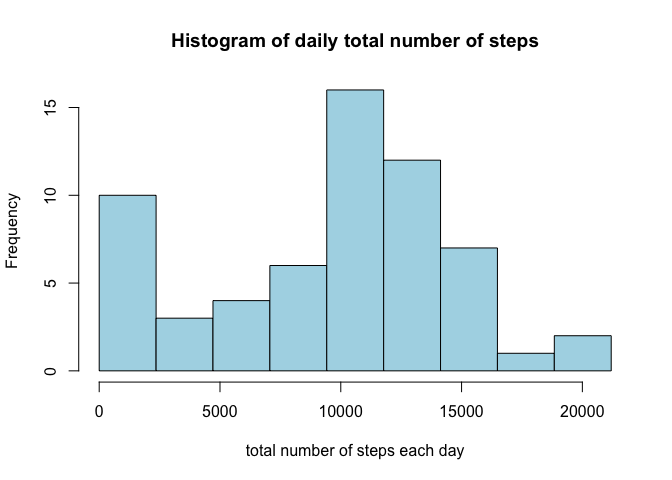
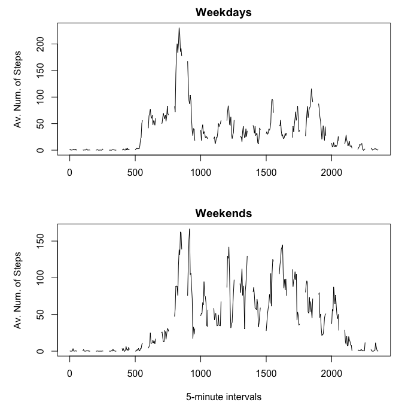

# Reproducible Research: Peer Assessment 1


## Loading and preprocessing the data


```r
unzip("activity.zip")
df <- read.csv(unzip("activity.zip",list = TRUE)[1,1])
df_REDUCE <- df[!is.na(df$steps),]
LVS <- levels(df_REDUCE$date)

MEDIAN <- AVERAGE <- TOTAL_STEPS <- vector(mode = "numeric", length = length(LVS))
```

## What is mean total number of steps taken per day?

* Calculating the total, average, and median values of number of steps taken every single day, and group them in one single data frame

```r
for(i in 1:length(LVS)) { 
  TOTAL_STEPS[i] = sum(df_REDUCE[df_REDUCE$date == LVS[i],]$steps, na.rm = TRUE) 
  AVERAGE[i] = mean(df_REDUCE[df_REDUCE$date == LVS[i],]$steps,na.rm = TRUE) 
  MEDIAN[i] = median(df_REDUCE[df_REDUCE$date == LVS[i],]$steps, na.rm = TRUE) 
} # Calculating the total, average, and median values of number of steps taken every single day

df_daily_statistics <- data.frame(Dates = as.Date(LVS, "%Y-%m-%d"), Total_steps = TOTAL_STEPS, Average = AVERAGE, Median = MEDIAN) # Group these results into a single data frame
```

* Histogram of daily total number of steps


```r
cutting.points = seq(0, max(df_daily_statistics$Total_steps), length.out = 10)
hist(df_daily_statistics$Total_steps, col = "lightblue", xlab = "total number of steps each day", main = "Histogram of daily total number of steps",breaks= cutting.points)
```

 


* Reporting the results


```r
print(df_daily_statistics)
```

```
##         Dates Total_steps    Average Median
## 1  2012-10-01           0        NaN     NA
## 2  2012-10-02         126  0.4375000      0
## 3  2012-10-03       11352 39.4166667      0
## 4  2012-10-04       12116 42.0694444      0
## 5  2012-10-05       13294 46.1597222      0
## 6  2012-10-06       15420 53.5416667      0
## 7  2012-10-07       11015 38.2465278      0
## 8  2012-10-08           0        NaN     NA
## 9  2012-10-09       12811 44.4826389      0
## 10 2012-10-10        9900 34.3750000      0
## 11 2012-10-11       10304 35.7777778      0
## 12 2012-10-12       17382 60.3541667      0
## 13 2012-10-13       12426 43.1458333      0
## 14 2012-10-14       15098 52.4236111      0
## 15 2012-10-15       10139 35.2048611      0
## 16 2012-10-16       15084 52.3750000      0
## 17 2012-10-17       13452 46.7083333      0
## 18 2012-10-18       10056 34.9166667      0
## 19 2012-10-19       11829 41.0729167      0
## 20 2012-10-20       10395 36.0937500      0
## 21 2012-10-21        8821 30.6284722      0
## 22 2012-10-22       13460 46.7361111      0
## 23 2012-10-23        8918 30.9652778      0
## 24 2012-10-24        8355 29.0104167      0
## 25 2012-10-25        2492  8.6527778      0
## 26 2012-10-26        6778 23.5347222      0
## 27 2012-10-27       10119 35.1354167      0
## 28 2012-10-28       11458 39.7847222      0
## 29 2012-10-29        5018 17.4236111      0
## 30 2012-10-30        9819 34.0937500      0
## 31 2012-10-31       15414 53.5208333      0
## 32 2012-11-01           0        NaN     NA
## 33 2012-11-02       10600 36.8055556      0
## 34 2012-11-03       10571 36.7048611      0
## 35 2012-11-04           0        NaN     NA
## 36 2012-11-05       10439 36.2465278      0
## 37 2012-11-06        8334 28.9375000      0
## 38 2012-11-07       12883 44.7326389      0
## 39 2012-11-08        3219 11.1770833      0
## 40 2012-11-09           0        NaN     NA
## 41 2012-11-10           0        NaN     NA
## 42 2012-11-11       12608 43.7777778      0
## 43 2012-11-12       10765 37.3784722      0
## 44 2012-11-13        7336 25.4722222      0
## 45 2012-11-14           0        NaN     NA
## 46 2012-11-15          41  0.1423611      0
## 47 2012-11-16        5441 18.8923611      0
## 48 2012-11-17       14339 49.7881944      0
## 49 2012-11-18       15110 52.4652778      0
## 50 2012-11-19        8841 30.6979167      0
## 51 2012-11-20        4472 15.5277778      0
## 52 2012-11-21       12787 44.3993056      0
## 53 2012-11-22       20427 70.9270833      0
## 54 2012-11-23       21194 73.5902778      0
## 55 2012-11-24       14478 50.2708333      0
## 56 2012-11-25       11834 41.0902778      0
## 57 2012-11-26       11162 38.7569444      0
## 58 2012-11-27       13646 47.3819444      0
## 59 2012-11-28       10183 35.3576389      0
## 60 2012-11-29        7047 24.4687500      0
## 61 2012-11-30           0        NaN     NA
```

## What is the average daily activity pattern?

* Computing the average numbers of steps in specific 5-min intervals, averaged over all available days

```r
INTERVALS <- seq(0,max(df$interval,na.rm = TRUE), by = 5)
Ave_interval_steps <- vector(mode = "numeric", length = length(INTERVALS))
for(i in 1:length(INTERVALS)) {
  Ave_interval_steps[i] <- mean( df$steps[df$interval == INTERVALS[i]] , na.rm = TRUE)
}
```

* Plotting the the average numbers of steps in specific 5-min intervals, against the intervals

```r
plot(INTERVALS,Ave_interval_steps,type ="l",xlab = "5-minute intervals", ylab = "Average number of steps")
```

 


* Reporting the interval with maximum average number of steps


```r
MAX <- round( max(Ave_interval_steps, na.rm = TRUE),4) 
MAX_ind <- which.max(Ave_interval_steps)
message("The 5-minute interval with maximum average number of steps is [",MAX_ind*5-5,",",MAX_ind*5,").", " with the maximum value ",MAX,"." , sep="")
```

```
## The 5-minute interval with maximum average number of steps is [835,840). with the maximum value 206.1698.
```


## Imputing missing values


```r
NAS <- is.na(df$steps) # Create a vector marking the location of NA's, where the indices of TRUE's are the indices of the rows with missing step numbers (step = NA)
sum(NAS) # Obtaining total number of TRUE's, ie, the total number of rows with NA in the data frame
```

```
## [1] 2304
```

* Fill NA's with the average value of that 5-minute interval across all days, and save the result in a new data frame named df_noNA


```r
STP_NoNA <- df$steps

for(i in 1:length(STP_NoNA)){
  if(is.na(STP_NoNA[i]) & !is.nan(Ave_interval_steps[df$interval[i]/5+1] )) STP_NoNA[i] <- Ave_interval_steps[df$interval[i]/5+1]
}

df_NoNA <- data.frame( steps = STP_NoNA, df[,2:3] )
```

* Compute the total, average, and median values of the number of steps of each day


```r
MEDIAN2 <- AVERAGE2 <- TOTAL_STEPS2 <- vector(mode = "numeric", length = length(LVS))

for(i in 1:length(LVS)) { 
  TOTAL_STEPS2[i] = sum(df_NoNA[df_NoNA$date == LVS[i],]$steps) 
  AVERAGE2[i] = mean(df_NoNA[df_NoNA$date == LVS[i],]$steps) 
  MEDIAN2[i] = median(df_NoNA[df_NoNA$date == LVS[i],]$steps) 
} # Calculating the total, average, and median values of number of steps taken every single day
```

* Plot the histogram with filled-in missing values


```r
hist(TOTAL_STEPS2, col = "blue", xlab = "total number of steps each day", main = "Histogram of daily total number of steps",breaks= cutting.points)
```

 


* Organizing the results obtained with filled-in missing values into a data frame, and report the result

```r
df_daily_statistics2 <- data.frame(Dates = as.Date(LVS, "%Y-%m-%d"), Total_steps = TOTAL_STEPS2, Average = AVERAGE2, Median = MEDIAN2) # Group these results into a single data frame

df_daily_statistics2
```

```
##         Dates Total_steps    Average   Median
## 1  2012-10-01    10766.19 37.3825996 34.11321
## 2  2012-10-02      126.00  0.4375000  0.00000
## 3  2012-10-03    11352.00 39.4166667  0.00000
## 4  2012-10-04    12116.00 42.0694444  0.00000
## 5  2012-10-05    13294.00 46.1597222  0.00000
## 6  2012-10-06    15420.00 53.5416667  0.00000
## 7  2012-10-07    11015.00 38.2465278  0.00000
## 8  2012-10-08    10766.19 37.3825996 34.11321
## 9  2012-10-09    12811.00 44.4826389  0.00000
## 10 2012-10-10     9900.00 34.3750000  0.00000
## 11 2012-10-11    10304.00 35.7777778  0.00000
## 12 2012-10-12    17382.00 60.3541667  0.00000
## 13 2012-10-13    12426.00 43.1458333  0.00000
## 14 2012-10-14    15098.00 52.4236111  0.00000
## 15 2012-10-15    10139.00 35.2048611  0.00000
## 16 2012-10-16    15084.00 52.3750000  0.00000
## 17 2012-10-17    13452.00 46.7083333  0.00000
## 18 2012-10-18    10056.00 34.9166667  0.00000
## 19 2012-10-19    11829.00 41.0729167  0.00000
## 20 2012-10-20    10395.00 36.0937500  0.00000
## 21 2012-10-21     8821.00 30.6284722  0.00000
## 22 2012-10-22    13460.00 46.7361111  0.00000
## 23 2012-10-23     8918.00 30.9652778  0.00000
## 24 2012-10-24     8355.00 29.0104167  0.00000
## 25 2012-10-25     2492.00  8.6527778  0.00000
## 26 2012-10-26     6778.00 23.5347222  0.00000
## 27 2012-10-27    10119.00 35.1354167  0.00000
## 28 2012-10-28    11458.00 39.7847222  0.00000
## 29 2012-10-29     5018.00 17.4236111  0.00000
## 30 2012-10-30     9819.00 34.0937500  0.00000
## 31 2012-10-31    15414.00 53.5208333  0.00000
## 32 2012-11-01    10766.19 37.3825996 34.11321
## 33 2012-11-02    10600.00 36.8055556  0.00000
## 34 2012-11-03    10571.00 36.7048611  0.00000
## 35 2012-11-04    10766.19 37.3825996 34.11321
## 36 2012-11-05    10439.00 36.2465278  0.00000
## 37 2012-11-06     8334.00 28.9375000  0.00000
## 38 2012-11-07    12883.00 44.7326389  0.00000
## 39 2012-11-08     3219.00 11.1770833  0.00000
## 40 2012-11-09    10766.19 37.3825996 34.11321
## 41 2012-11-10    10766.19 37.3825996 34.11321
## 42 2012-11-11    12608.00 43.7777778  0.00000
## 43 2012-11-12    10765.00 37.3784722  0.00000
## 44 2012-11-13     7336.00 25.4722222  0.00000
## 45 2012-11-14    10766.19 37.3825996 34.11321
## 46 2012-11-15       41.00  0.1423611  0.00000
## 47 2012-11-16     5441.00 18.8923611  0.00000
## 48 2012-11-17    14339.00 49.7881944  0.00000
## 49 2012-11-18    15110.00 52.4652778  0.00000
## 50 2012-11-19     8841.00 30.6979167  0.00000
## 51 2012-11-20     4472.00 15.5277778  0.00000
## 52 2012-11-21    12787.00 44.3993056  0.00000
## 53 2012-11-22    20427.00 70.9270833  0.00000
## 54 2012-11-23    21194.00 73.5902778  0.00000
## 55 2012-11-24    14478.00 50.2708333  0.00000
## 56 2012-11-25    11834.00 41.0902778  0.00000
## 57 2012-11-26    11162.00 38.7569444  0.00000
## 58 2012-11-27    13646.00 47.3819444  0.00000
## 59 2012-11-28    10183.00 35.3576389  0.00000
## 60 2012-11-29     7047.00 24.4687500  0.00000
## 61 2012-11-30    10766.19 37.3825996 34.11321
```

## Are there differences in activity patterns between weekdays and weekends?

* Creating the vector indicating whether each row is of Weekday or Weekend, and binding this vector with the data frame


```r
Days <- weekdays(as.Date(df_NoNA$date, "%Y-%m-%d"))

for(i in 1:length(Days)) {
  if(Days[i]=="Samedi" | Days[i]=="Dimanche") Days[i] <- "Weekend"
  else Days[i] <- "Weekday"
}
df_NoNA <- cbind(df_NoNA, "WD.or.WE"=factor(Days))

Ave_interval_steps_WD <- Ave_interval_steps_WE <- vector(mode = "numeric", length = length(INTERVALS))
for(i in 1:length(INTERVALS)) {
  Ave_interval_steps_WD[i] <- mean( df_NoNA$steps[(df_NoNA$interval == INTERVALS[i])&(Days=="Weekday")] , na.rm = TRUE)
  Ave_interval_steps_WE[i] <- mean( df_NoNA$steps[(df_NoNA$interval == INTERVALS[i])&(Days=="Weekend")] , na.rm = TRUE)
}
```


```r
par(mfrow=c(2,1),mar=c(4,5,2,1),asp=0.6)
```

```
## Warning in par(mfrow = c(2, 1), mar = c(4, 5, 2, 1), asp = 0.6): "asp"
## n'est pas un paramètre graphique
```

```r
plot(INTERVALS,Ave_interval_steps_WD,xlab="",ylab="Av. Num. of Steps",main="Weekdays",type="l")
plot(INTERVALS,Ave_interval_steps_WD,xlab="5-minute intervals",ylab="Av. Num. of Steps",main="Weekends",type="l")
```

 
